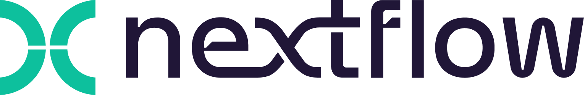
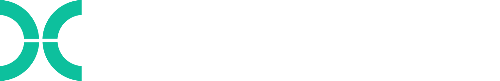

# Reproducible bioinformatics workflows with Nextflow and nf-core

 

  
  

 

[Nextflow](https://www.nextflow.io/) is workflow management software that lets you write scalable, reproducible scientific workflows. It is widely used in bioinformatics for pipelines such as variant calling, RNA-seq, and metagenomics, and lets existing scripts in languages like R and Python be coupled together into a single workflow.

Nextflow integrates with common software packaging and environment management systems, including Docker, Apptainer, Conda, and environment modules. It simplifies running workflows on cloud and high-performance computing (HPC) infrastructures.

The workshop also covers [nf-core](https://nf-co.re/), a community-driven project providing peer-reviewed, best-practice analysis pipelines built with Nextflow.

!!! clipboard-list "Objectives"

    - Explain the structure of a Nextflow workflow.
    - Use the fundamental Nextflow commands and options.
    - Describe the key features of an nf-core pipeline.
    - Customise the execution of an nf-core pipeline.
    - Evaluate the resource usage of a pipeline and adjust settings to improve efficiency.

!!! tutor "Trainers"

    - [Chris Hakkaart](https://github.com/christopher-hakkaart) ([Seqera](https://seqera.io/))
    - [Jen Reeve](https://github.com/jen-reeve) ([REANNZ](https://reannz.co.nz))

!!! check "Learning outcomes"

    By the end of this workshop you will be able to:

    - Describe what Nextflow is and the problems it solves for bioinformatics workflows
    - Run and inspect a Nextflow pipeline from the command line
    - Explain what nf-core is and how its pipelines are structured
    - Configure an nf-core pipeline for your own data and compute environment
    - Apply best practices when running and sharing Nextflow pipelines

!!! info "Prerequisites"

    - Familiarity with the Linux command line (navigating directories, running commands, editing files)
    - No prior experience with Nextflow or nf-core is required

## Setup

During this workshop, code will be run in real-time to demonstrate how Nextflow works.
This will be run on the REANNZ OpenOnDemand platform which already has all the required software installed.

## Acknowledgements

This workshop material was developed by [Chris Hakkaart](https://github.com/christopher-hakkaart) ([Seqera](https://seqera.io/)) and [Jen Reeve](https://github.com/jen-reeve) ([REANNZ](https://reannz.co.nz)).
