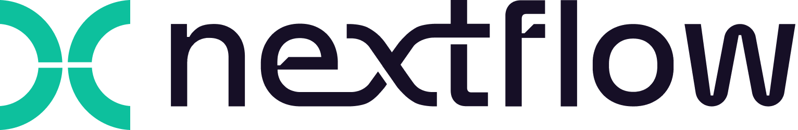

# Get started with Nextflow

!!! clipboard-list "Objectives"

    - Learn about the core features of Nextflow
    - Learn Nextflow terminology
    - Learn fundamental commands and options for executing pipelines

## What is Nextflow?

<p align="center"></p>

Nextflow is a **workflow orchestration engine** that makes it easy to write data-intensive computational pipelines.

It is designed around the idea that the Linux platform is the lingua franca of data science. Linux provides many simple but powerful command-line and scripting tools that, when chained together, facilitate complex data manipulations.

Nextflow extends this approach, adding the ability to define complex program interactions and a high-level parallel computational environment based on the dataflow programming model.

**Nextflow’s core features are:**

- Pipeline portability and reproducibility
- Scalability of parallelization and deployment
- Integration of existing tools, systems, and industry standards

Whether you are working with genomics data or other large and complex data sets, Nextflow can help you to streamline your pipeline and improve your productivity.

## Processes and dataflow

In Nextflow, **workflows**, **processes**, and **dataflow logic** are the fundamental building blocks of a pipeline.

A **workflow** is a specialized function for composing processes and dataflow logic. Workflows connect process inputs and outputs through dataflow logic, defining how data moves through the pipeline. An entry workflow serves as the pipeline’s entry point, while named workflows can be reused and called by other workflows, enabling modular pipeline design.

A **process** is a unit of execution that represents a single computational step in a pipeline. Each process specifies its inputs and outputs, as well as any directives and conditional statements required for its execution. Processes can be written in any scripting language that can be executed by the Linux platform, such as Bash, Python, Perl, Ruby, or R.

Processes are executed independently (i.e., they do not share a common writable state) as **tasks**. Each process executes a task and emits a value for each input it receives, enabling downstream processes to automatically receive and process those values. Multiple tasks can run in parallel, allowing for efficient utilisation of computing resources.

Processes can be **parameterised** to allow for flexibility and reuse within and across pipelines. Pipeline-level parameters (`params`) can be passed into processes at runtime to control behaviour, such as specifying input files, output paths, or tool-specific settings.

Dataflow logic defines how data flows between processes through two types of asynchronous dataflow structures:

<!-- TODO: Add links to relevant docs -->
- A **dataflow channel** (or simply _channel_) is an asynchronous sequence of values used to pass data between processes.
- A **dataflow value** is a single asynchronous value, typically used for inputs shared across all tasks (e.g., a reference genome).

The data dependencies between processes implicitly determine the order of execution, meaning processes run based on their input-output relationships rather than the order they appear in the pipeline script.

## Execution abstraction

While a process defines what command or script is executed, the **executor** determines how and where the script is executed.

Nextflow provides an **abstraction** between the pipeline’s functional logic and the underlying execution system. This means a pipeline can be written once and run on your local machine, an HPC cluster, or a cloud platform without any modification. Only the target executor needs to be defined in the configuration file.

By default, Nextflow executes processes on the local machine, which is useful for development and testing. For production workloads, Nextflow supports major HPC batch schedulers (e.g., SLURM, PBS, Open Grid Engine) and cloud platforms (e.g., AWS, Google Cloud, Azure, Kubernetes).

See [Executors](https://www.nextflow.io/docs/latest/executor.html) for a full list of Nextflow executors.

## Nextflow CLI

Nextflow is a workflow language based on **Groovy** (a superset of Java) that simplifies the writing of complex, scalable, and reproducible pipelines. Users can leverage existing programming knowledge without a steep learning curve, as process scripts can be written in any Linux-compatible language (Bash, Python, Perl, Ruby, etc.).

Nextflow provides a robust **command line interface (CLI)** for managing and executing pipelines. It runs on any POSIX-compatible system (Linux, macOS, etc.) and on Windows through WSL.

It requires Bash 3.2 (or later) and Java 17 (or later).

<!-- TODO: Add link to local environment setup -->

Nextflow is distributed as a self-installing package and does not require any special installation procedure.

<!-- TODO: How to load on local infra -->
!!! info "How to install Nextflow locally"

    1. Download the executable package using either `wget -qO- https://get.nextflow.io | bash` or `curl -s https://get.nextflow.io | bash`
    2. Make the binary executable on your system by running `chmod +x nextflow`
    3. Move the nextflow file to a directory accessible by your `$PATH` variable, e.g, `mv nextflow ~/bin/`

## Nextflow options and commands

Nextflow provides a robust command line interface for the management and execution of pipelines. The top-level interface consists of options and commands.

You can list Nextflow options and commands with the `-h` option:

```bash
nextflow -h
```

<!-- TODO: Show current output (expected results) -->

Options for a command can also be viewed by appending the `-help` option to a Nextflow command.

For example, you can view options for the `run` command:

```bash
nextflow run -help
```

<!-- TODO: Show current output (expected results) -->

!!! question "Exercise"

    Use the help command to find the version command. Then, use the version command to find out which version of Nextflow you are using.

    ??? success "Solution"
    
        Find out which version of Nextflow you are using by executing:

        ```bash
        nextflow -version
        ```

        Your output should look similar to the following:

        ```console title="Output"
        N E X T F L O W
        version 25.10.4 build 5982
        created 28-10-2025 15:34 UTC (29-10-2025 04:34 NZDT)
        cite doi:10.1038/nbt.3820
        http://nextflow.io
        ```

        <!-- TODO: Check this is true -->


## Managing your environment

You can use [environment variables](https://www.nextflow.io/docs/latest/config.html#environment-variables) to control the Nextflow runtime and the underlying Java virtual machine. These variables can be exported before running a pipeline and will be interpreted by Nextflow.

For most users, Nextflow will work without setting any environment variables. However, to improve reproducibility and to optimise your resources, you will benefit from setting some of these variables.

For example, for consistency, it is good practice to pin the version of Nextflow you are using with the `NXF_VER` variable:

```bash
export NXF_VER=<version number>
```

!!! question "Exercise"

    Pin the version of Nextflow you are using to `25.04.4` by exporting an environment variable:

    ??? success "Solution"

        Export the Nextflow version using the `NXF_VER` environment variable:

        ```bash
        export NXF_VER=25.04.4
        ```

        Check that the `NXF_VER` has been applied:

        ```bash
        nextflow -version
        ```

        You should see nextflow update and print the following:

        ```console title="Output"
        N E X T F L O W
        version 25.04.4 build 5957
        created 01-04-2025 21:09 UTC (02-04-2025 09:09 NZDT)
        cite doi:10.1038/nbt.3820
        http://nextflow.io
        ```

        <!-- TODO: Show how to append at the start of a command NXF_VER=25.04.4 nextflow --version -->

!!! warning "Environment variables on NeSI"

    The behaviour of Nextflow environment variables won't work as expected if using a NeSI Nextflow module.

<!-- TODO: Update to apptainer or alternate -->
Similarly, if you are using a shared resource, you may also consider including paths to where software is stored and can be accessed using the `NXF_SINGULARITY_CACHEDIR` or the `NXF_CONDA_CACHEDIR` variables:

```bash
export NXF_SINGULARITY_CACHEDIR=<custom/path/to/singularity/cache>
```

!!! question "Exercise"

    <!-- TODO: Check this link is correct -->
    Export the folder `/nesi/nobackup/nesi02659/nextflow-workshop` as the folder where remote Singularity images are stored:

    ??? success "Solution"

        Export the singularity cache using the `NXF_SINGULARITY_CACHEDIR` environment variable:

        ```bash
        export NXF_SINGULARITY_CACHEDIR=/nesi/nobackup/nesi02659/nextflow-workshop
        ```

        Check that the `NXF_SINGULARITY_CACHEDIR` has been exported:

        ```bash
        echo $NXF_SINGULARITY_CACHEDIR
        ```

See [Environment variables](https://www.nextflow.io/docs/latest/config.html#environment-variables) for a complete list of environment variables.

!!! tip "How to manage environment variables"

    You may want to include these, or other environment variables, in your `.bashrc` file (or alternate) that is loaded when you log in so you don’t need to export variables every session.

## Executing a pipeline

Nextflow seamlessly integrates with code repositories such as [GitHub](https://github.com/). This feature allows you to manage your project code and use public Nextflow pipelines quickly, consistently, and transparently.

The Nextflow `pull` command will download a pipeline from a hosting platform into your global cache `$HOME/.nextflow/assets` folder. 

If you are pulling a project hosted in a remote code repository, you can specify its qualified name or the repository URL.

The qualified name is formed by two parts - the owner name and the repository name separated by a `/` character. For example, if a Nextflow project `bar` is hosted in a GitHub repository `foo` at the address `http://github.com/foo/bar`, it could be pulled using:

```bash
nextflow pull foo/bar
```

Or by using the complete URL:

```bash
nextflow pull http://github.com/foo/bar
```

Alternatively, the Nextflow `clone` command can be used to download a pipeline into a local directory of your choice:

```bash
nextflow clone foo/bar <your/path>
```

The Nextflow `run` command is used to initiate the execution of a pipeline:

```bash
nextflow run foo/bar
```

If you `run` a pipeline, it will look for a local file with the pipeline name you’ve specified. If that file does not exist, it will look for a public repository with the same name on GitHub (unless otherwise specified). If found, Nextflow will automatically `pull` the pipeline to your global cache and execute it.

!!! warning
    
    Be aware of what is already in your current working directory where you launch your pipeline. If your current working directory contains nextflow configuration files you may encounter unexpected results.

!!! question "Exercise"

    Execute the `hello` pipeline directly from `nextflow-io` [GitHub](https://github.com/nextflow-io/hello) repository.

    ??? success "Solution"

        Use the `run` command to execute the [nextflow-io/hello](https://github.com/nextflow-io/hello) pipeline:

        ```bash
        nextflow run nextflow-io/hello
        ```

        ```console title="Output"
        N E X T F L O W  ~  version 25.10.4
        Pulling nextflow-io/hello ...
        downloaded from https://github.com/nextflow-io/hello.git
        Launching `https://github.com/nextflow-io/hello` [silly_sax] DSL2 - revision: 1d71f857bb [master]
        executor >  local (4)
        [e6/2132d2] process > sayHello (3) [100%] 4 of 4 ✔
        Hola world!

        Bonjour world!

        Ciao world!

        Hello world!
        ```

See [`run`](https://www.nextflow.io/docs/latest/cli.html#run) for more information about the Nextflow `run` command.

### Understanding console outputs

<!-- TODO: High level processes as tasks. More to come later about task directory -->

## Executing a revision

When a Nextflow pipeline is created or updated using GitHub (or another code repository), a new revision is created. Each revision is identified by a unique number, which can be used to track changes made to the pipeline and to ensure that the same version of the pipeline is used consistently across different runs.

The Nextflow `info` command can be used to view pipeline properties, such as the project name, repository, local path, main script, and revisions. The `*` indicates which revision of the pipeline is pinned and will be executed when using the `run` command.

```bash
nextflow info <pipeline>
```

It is recommended that you use the revision flag every time you execute a pipeline to ensure that the version is correct.

To use a specific revision, you simply need to add it to the command line with the `-revision` or `-r` flag. For example, to run a pipeline with the `v1.0` revision, you would use the following:

```bash
nextflow run <pipeline> -r v1.0
```

Nextflow automatically provides built-in support for version control using Git. With this, users can easily manage and track changes made to a pipeline over time. A revision can be a git `branch`, `tag` or commit `SHA` number, and can be used interchangeably.

!!! question "Exercise"

    Execute the `hello` pipeline directly from the `nextflow-io` GitHub using the `v1.1` revision tag.

    <!-- TODO: Expected fail, use NXF_VER=22.10.0 nextflow run nextflow-io/hello -r v1.1 -->
    ??? success "Solution"

        Use the `nextflow run` command to execute the `nextflow-io/hello` pipeline with the `v1.1` revision tag:

        ```bash
        nextflow run nextflow-io/hello -r v1.1
        ```

        ```console title="Output"
        N E X T F L O W  ~  version 25.10.4
        NOTE: Your local project version looks outdated - a different revision is available in the remote repository [3b355db864]
        Launching `https://github.com/nextflow-io/hello` [amazing_lovelace] DSL2 - revision: baba3959d7 [v1.1]
        executor >  local (4)
        [e6/cfda06] process > sayHello (4) [100%] 4 of 4 ✔
        Bonjour world! (version 1.1)

        Hello world! (version 1.1)

        Ciao world! (version 1.1)

        Hola world! (version 1.1)
        ```

## Nextflow log

It is important to keep a record of the commands you have run to generate your results. Nextflow helps with this by creating and storing metadata and logs about the run in hidden files and folders in your current directory (unless otherwise specified). This data can be used by Nextflow to generate reports. It can also be queried using the Nextflow `log` command:

```bash
nextflow log
```

The `log` command has multiple options to facilitate the queries and is especially useful while debugging a pipeline and inspecting execution metadata. You can view all of the possible `log` options with `-h` flag:

```bash
nextflow log -h
```

To query a specific execution you can use the `RUN NAME` or a `SESSION ID`:

```bash
nextflow log <run_name>
```

To get more information, you can use the `-f` option with named fields. For example:

```bash
nextflow log <run_name> -f process,hash,duration
```

There are many other fields you can query. You can view a full list of fields with the `-l` option:

```bash
nextflow log -l
```

!!! question "Exercise"

    Use the `log` command to view the `process`, `hash`, and `script` fields for your tasks from your most recent Nextflow execution.

    ??? success "Solution"

        Use the `log` command to get a list of your recent executions:

        ```bash
        nextflow log
        ```

        ```console title="Output"
        TIMESTAMP               DURATION        RUN NAME                STATUS  REVISION ID     SESSION ID                              COMMAND
        2025-08-29 07:33:48     3.6s            stupefied_bernard       OK      1d71f857bb      f9e18b71-d689-4589-be34-8cd98c1aab2e    nextflow run nextflow-io/hello
        ```

        Query the process, hash, and script using the `-f` option for the most recent run:

        ```bash
        nextflow log stupefied_bernard -f process,hash,script
        ```

        ```console title="Output"
        sayHello        f3/8f827f
            echo 'Hola world!'
            
        sayHello        b8/b66545
            echo 'Ciao world!'
            
        sayHello        3c/498a68
            echo 'Bonjour world!'
            
        sayHello        6e/8d5b1a
            echo 'Hello world!'
        ```

## Execution cache and resume

Task execution **caching** is an essential feature of modern pipeline managers, and Nextflow provides an automated caching mechanism for every execution.

When using the Nextflow `-resume` option, successfully completed tasks from previous executions are skipped and the previously cached results are used in downstream tasks.

Nextflow's caching mechanism works by assigning a unique ID to each task. The task unique ID is generated as a 128-bit hash value composing the complete file path, file size, and last modified timestamp. These IDs are used to create a separate execution directory where the tasks are executed and the outputs are stored. Nextflow will take care of the inputs and outputs in these folders for you.

A multi-step pipeline is required to demonstrate cache and resume.

These concepts will be demonstrated using the nf-core demo pipeline as a part of the [Getting started with nf-core](2_nfcore.md) section.

## Listing and dropping cached pipelines

Over time, you might want to remove stored pipelines. Nextflow also has functionality to help you to view and remove pipelines that have been pulled locally.

The Nextflow `list` command prints the projects stored in your global cache folder (`$HOME/.nextflow/assets`). These are the pipelines that were pulled when you executed either of the Nextflow `pull` or `run` commands:

```bash
nextflow list
```

If you want to remove a pipeline from your cache you can remove it using the Nextflow `drop` command:

```bash
nextflow drop <pipeline>
```

!!! question "Exercise"

    View your cached pipelines with the Nextflow `list` command and remove the `nextflow-io/hello` pipeline with the `drop` command.

    ??? success "Solution"

        List your pipeline assets:

        ```bash
        nextflow list
        ```

        Drop the `nextflow-io/hello` pipeline:

        ```bash
        nextflow drop nextflow-io/hello
        ```

        Check it has been removed:

        ```bash
        nextflow list
        ```
<br>
!!! circle-info ""

!!! cboard-list-2 "Key points"

    - Nextflow is a pipeline orchestration engine that makes it easy to write data-intensive computational pipelines
    - Environment variables can be used to control your Nextflow runtime and the underlying Java virtual machine
    - Nextflow supports version control and has automatic integrations with online code repositories.
    - Nextflow will cache your runs and they can be resumed with the `-resume` option
    - You can manage pipelines with Nextflow commands (e.g., `pull`, `clone`, `list`, and `drop`)
