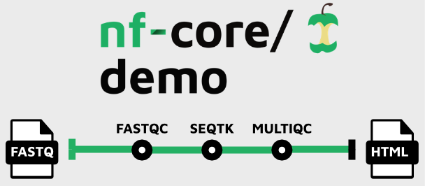

# Get started with nf-core

!!! clipboard-list "Objectives"

    - Describe the nf-core resources.
    - Use Nextflow to pull the `nf-core/demo` workflow.
    - Practice resuming and cleaning Nextflow workflows.

## What is nf-core?

<p align="center">
  
  
</p>

[nf-core](https://nf-co.re/) is a **community** effort to collect a curated set of **analysis workflows** built using Nextflow.

nf-core provides a standardised set of **best practices**, **guidelines**, and **templates** for building and sharing bioinformatics workflows. These workflows are designed to be **modular**, **scalable**, and **portable**, allowing researchers to easily adapt and execute them using their own data and compute resources.

The community is a diverse group of bioinformaticians, developers, and researchers from around the world who collaborate on **developing** and **maintaining** a growing collection of high-quality workflows. These workflows cover a range of applications, including transcriptomics, proteomics, and metagenomics.

One of the key benefits of nf-core is that it promotes **open development**, **testing**, and **peer review**, ensuring that the workflows are robust, well-documented, and validated against real-world datasets. This helps to increase the reliability and reproducibility of bioinformatics analyses and ultimately enables researchers to accelerate their scientific discoveries.

nf-core is published in Nature Biotechnology: [Nat Biotechnol 38, 276–278 (2020)](https://www.nature.com/articles/s41587-020-0439-x).

**Key Features of nf-core workflows**

- **Documentation**
    - nf-core workflows have extensive documentation covering installation, usage, and description of output files to ensure that you won't be left in the dark.
- **CI Testing**
    - Every time a change is made to the workflow code, nf-core workflows use continuous-integration testing to ensure that nothing has broken.
- **Stable Releases**
    - nf-core workflows use GitHub releases to tag stable versions of the code and software, making workflow runs totally reproducible.
- **Packaged software**
    - Pipeline dependencies are automatically downloaded and handled using Docker, Apptainer, Conda, or other software management tools. There is no need for any software installations.
- **Portable and reproducible**
    - nf-core workflows follow best practices to ensure maximum portability and reproducibility. The large community makes the workflows exceptionally well-tested and easy to execute.
- **Cloud-ready**
    - nf-core workflows are tested on AWS after every major release. You can even browse results live on the website and use outputs for your own benchmarking.

It is important to remember all nf-core workflows are **open-source** and **community driven**. Pipelines are under active community development and are regularly updated with fixes and other improvements. Even though the pipelines and tools undergo repeated community review and testing — it is important to check your results.

## Events

nf-core events are **community-driven** gatherings that provide a platform to discuss the latest developments in Nextflow and nf-core workflows. These events include community **seminars**, **trainings**, and **hackathons**, and are open to anyone who is interested in using and developing nf-core and its applications. Most events are held virtually, making them accessible to a global audience.

Upcoming events are listed on the [nf-core event page](https://nf-co.re/events) and announced on [Slack](https://nf-co.re/join/slack) and [X (formerly Twitter)](https://twitter.com/nf_core).

## Join the community!

There are several ways you can join the nf-core community. You are welcome to join any or all of these at any time!

<a href="https://nf-co.re/join/slack"></a>
<a href="https://github.com/nf-core"></a>
<a href="https://twitter.com/nf_core"></a>
<a href="https://mstdn.science/@nf_core"></a>
<a href="https://www.youtube.com/c/nf-core"></a>
<a href="https://bsky.app/profile/nf-co.re"></a>
<a href="https://www.linkedin.com/company/nf-core"></a>

The nf-core Slack is one of the primary resources for nf-core users. There are dedicated channels for all workflows as well as channels for common topics.

If you are unsure of where to ask your questions — the `#help` and `#nostupidquestions` channels are a great place to start.

Joining multiple nf-core and Nextflow channels is important to keep up to date with the latest community developments and updates. In particular, following the [nf-core](https://twitter.com/nf_core) and [Nextflow](https://twitter.com/nextflowio) accounts on X (formerly Twitter) will keep you up-to-date with community announcements. If you are looking for more information about a workflow, the [nf-core YouTube channel](https://www.youtube.com/c/nf-core) regularly shares [ByteSize seminars](https://nf-co.re/events/bytesize/) about best practices, workflows, and community developments.

!!! question "Optional exercise"

    Join the [nf-core Slack](https://nf-co.re/join/slack) and fill in your profile information. If you're joining the nf-core Slack for the first time make sure you drop a message in `#say-hello` to introduce yourself! 👋

    ??? success "Solution"

        Follow [this link](https://nf-co.re/join/slack) to join the nf-core Slack. Follow the instructions to enter your credentials and update your profile. Even if you are already a member of the nf-core Slack, it's a great time to check your profile is up-to-date.

## nf-core tools

nf-core publishes a Python toolkit ([`nf-core/tools`](https://nf-co.re/tools/)) with helper commands for **using**, **developing**, and **testing** workflows. Most commands are aimed at **developers** building or maintaining pipelines, but a handful are useful to anyone running them. It is already installed in your workshop environment.

Outside the workshop you can install it from [PyPI](https://pypi.org/project/nf-core/) (`pip install nf-core`) or [Bioconda](https://anaconda.org/bioconda/nf-core) (`conda install -c bioconda nf-core`).

!!! question "Exercise"

    Check your installed version and browse the available commands:

    ```bash
    nf-core --version
    nf-core --help
    ```

    ??? success "Solution"

        `--version` prints the installed version. `--help` lists every command, grouped into options, user commands, and developer commands.

## Executing an nf-core workflow

There are currently **over 100 workflows** available as part of nf-core. These workflows are at various stages of development with many released, under active development, or archived.

The [nf-core website](https://nf-co.re/) has a full list of workflows, as well as their documentation, which can be explored.

Each workflow has a dedicated page that includes expansive documentation that is split into 6 sections:

- **Introduction:** An introduction and overview of the workflow
- **Usage:** Descriptions of how to execute the workflow
- **Parameters:** Grouped workflow parameters with descriptions
- **Output:** Descriptions and examples of the expected output files
- **Results:** Example output files generated from the full test dataset
- **Releases & Statistics:** Workflow version history and statistics

Unless you are actively developing workflow code, you don't need to clone the workflow code from GitHub and can use Nextflow's built-in functionality to `pull` a workflow. As shown in the previous lesson, the Nextflow `pull` command can download and cache workflows from [GitHub](https://github.com/nf-core/) repositories:

```bash
nextflow pull nf-core/<pipeline>
```

Nextflow `run` will also automatically `pull` the workflow if it was not already available locally:

```bash
nextflow run nf-core/<pipeline>
```

Nextflow will `pull` the default git branch if a workflow version is not specified. This will be the default branch (typically `master`, or `main` on newer pipelines) for nf-core workflows with a stable release. nf-core workflows use GitHub releases to tag stable versions of the code and software. You will always be able to execute a previous version of a workflow once it is released using the `-revision` or `-r` flag.

## nf-core demo

The [`nf-core/demo`](https://github.com/nf-core/demo) is a very small nf-core pipeline. It uses real data and bioinformatics software and requires additional configuration to run successfully.



The [`nf-core/demo`](https://github.com/nf-core/demo) pipeline was created with the nf-core `create` command and has the same structure as nf-core pipelines. It is a toy example with 3 processes:

1. [`FASTQC`](https://github.com/nf-core/demo/blob/main/modules/nf-core/fastqc/main.nf)
    - Executes [FastQC](https://www.bioinformatics.babraham.ac.uk/projects/fastqc/) using the test `.fastq.gz` files as inputs.
2. [`SEQTK_TRIM`](https://github.com/nf-core/demo/blob/main/modules/nf-core/seqtk/trim/main.nf)
    - Trims low-quality bases from FASTQ files using [SeqTK](https://github.com/lh3/seqtk).
3. [`MULTIQC`](https://github.com/nf-core/demo/blob/main/modules/nf-core/multiqc/main.nf)
    - Executes [MultiQC](https://multiqc.info/) using the FastQC reports generated by the `FASTQC` process.

To run this pipeline, both the `test` profile and a software management profile (such as `apptainer`) are required:

```bash
nextflow run nf-core/demo -profile test,apptainer -r 1.1.0 --outdir results
```

The command line output will print something like this:

```console title="Output"
 N E X T F L O W   ~  version 25.10.4

Launching `https://github.com/nf-core/demo` [evil_torricelli] DSL2 - revision: 45904cb9d1 [1.1.0]


------------------------------------------------------
                                        ,--./,-.
        ___     __   __   __   ___     /,-._.--~'
  |\ | |__  __ /  ` /  \ |__) |__         }  {
  | \| |       \__, \__/ |  \ |___     \`-._,-`-,
                                        `._,._,'
  nf-core/demo 1.1.0
------------------------------------------------------

Input/output options
  input                     : https://raw.githubusercontent.com/nf-core/test-datasets/viralrecon/samplesheet/samplesheet_test_illumina_amplicon.csv
  outdir                    : results

Institutional config options
  config_profile_name       : Test profile
  config_profile_description: Minimal test dataset to check pipeline function

Generic options
  trace_report_suffix       : 2026-03-13_15-12-38

Core Nextflow options
  revision                  : 1.1.0
  runName                   : evil_torricelli
  containerEngine           : apptainer
  launchDir                 : /home/shared/trainer1
  workDir                   : /home/shared/trainer1/work
  projectDir                : /home/shared/trainer1/.nextflow/assets/nf-core/demo
  userName                  : trainer1
  profile                   : test,apptainer
  configFiles               : /home/shared/trainer1/.nextflow/assets/nf-core/demo/nextflow.config

!! Only displaying parameters that differ from the pipeline defaults !!
------------------------------------------------------

* The pipeline
    https://doi.org/10.5281/zenodo.12192442

* The nf-core framework
    https://doi.org/10.1038/s41587-020-0439-x

* Software dependencies
    https://github.com/nf-core/demo/blob/master/CITATIONS.md

executor >  local (7)
[27/5fa7c0] NFCORE_DEMO:DEMO:FASTQC (SAMPLE3_SE)     [100%] 3 of 3 ✔
[ce/582855] NFCORE_DEMO:DEMO:SEQTK_TRIM (SAMPLE3_SE) [100%] 3 of 3 ✔
[73/3bb38e] NFCORE_DEMO:DEMO:MULTIQC                 [100%] 1 of 1 ✔
-[nf-core/demo] Pipeline completed successfully-

Completed at: 13-Mar-2026 15:13:43
Duration    : 1m 2s
CPU hours   : (a few seconds)
Succeeded   : 7
```

Executing this pipeline will create a `work` directory and a `results` directory with selected results files.

In the output above, the hexadecimal numbers, such as `27/5fa7c0`, identify the unique task execution. These numbers are also the prefix of the `work` directories where each task is executed.

You can inspect the files produced by a task by looking inside its `work` directory. Use the prefix shown in the output to find the task-specific execution path — for example:

```bash
ls work/27/5fa7c0*
```

The files that have been selected for publication in the `results` folder can also be explored:

```bash
ls results
```

If you look inside the `work` directory of a `FASTQC` task, you will find the files that were staged and created when this task was executed:

```bash
ls work/27/5fa7c0*/
```

The `FASTQC` process runs three times, executing in a different work directory for each set of inputs. Therefore, in the previous example, the work directory `[27/5fa7c0]` represents just one of the three sets of input data that was processed.

To print all the relevant paths to the screen, the `-ansi-log` option can be used when executing your pipeline:

```bash
nextflow run nf-core/demo -profile test,apptainer -r 1.1.0 --outdir results -ansi-log false
```

It's very likely you will execute a pipeline multiple times as you find the parameters that best suit your data. You can save a lot of space (and time) if you **resume** a pipeline from the last step that was completed successfully or unmodified.

By adding the `-resume` option to your `run` command you can use the cache rather than re-running successful tasks:

```bash
nextflow run nf-core/demo -profile test,apptainer -r 1.1.0 --outdir results -resume
```

If you `run` the `nf-core/demo` pipeline again without making any changes you will see that the cache is used:

```console title="Output"
[truncated]
executor >  local (0)
[27/5fa7c0] process > NFCORE_DEMO:DEMO:FASTQC (SAMPLE3_SE)     [100%] 3 of 3, cached: 3 ✔
[ce/582855] process > NFCORE_DEMO:DEMO:SEQTK_TRIM (SAMPLE3_SE) [100%] 3 of 3, cached: 3 ✔
[73/3bb38e] process > NFCORE_DEMO:DEMO:MULTIQC                 [100%] 1 of 1, cached: 1 ✔
[truncated]
```

In practical terms, the pipeline is executed from the beginning. However, before launching the execution of a process, Nextflow uses the task unique ID to check if the work directory already exists and that it contains a valid command exit state with the expected output files. If this condition is satisfied, the task execution is skipped and previously computed results are used as the process results.

The `-resume` functionality is very sensitive. Even touching a file in the work directory may invalidate the cache.

!!! note

    Because `nf-core/demo` is written without many parameters or local input files (test data is fetched remotely via the `test` profile), demonstrating cache invalidation by `touch`ing a staged linked file won't invalidate the cache. We can demonstrate the same idea by deleting a staged file.

!!! question "Exercise"

    Invalidate the cache by deleting a `.fastq.gz` file in a `FASTQC` task work directory (you can use the `rm` command). Execute the pipeline again with the `-resume` option to show that the cache has been invalidated.

    ??? success "Solution"

        Execute the pipeline for the first time (if you have not already).

        ```bash
        nextflow run nf-core/demo -profile test,apptainer -r 1.1.0 --outdir results
        ```

        Use the task ID shown for the `FASTQC` process and use it to find and `rm` a `.fastq.gz` file in that task's work directory:

        ```bash
        rm work/b2/87370687cc7cdec037ce4f36807d32/sample1_R1.fastq.gz
        ```

        Execute the pipeline again with the `-resume` command option:

        ```bash
        nextflow run nf-core/demo -profile test,apptainer -r 1.1.0 --outdir results -resume
        ```

        You should see that the affected `FASTQC` task, the corresponding `SEQTK_TRIM` task, and the `MULTIQC` task were invalidated and executed again.

        **Why did this happen?**

        In this example, the cache of the `FASTQC` task was invalidated because the `sample1_R1.fastq.gz` file was removed. Deleting the staged file meant Nextflow could no longer verify the task's inputs, so it re-ran the affected task and all downstream tasks that depended on its output.

Your work directory can get very big very quickly (especially if you are using full sized datasets). It is good practice to `clean` your work directory regularly. Rather than removing the `work` folder with all of its contents, the Nextflow `clean` function allows you to selectively remove data associated with specific runs.


```bash
nextflow clean -help
```

The `-after`, `-before`, and `-but` options are all very useful to select specific runs to `clean`. The `-dry-run` option is also very useful to see which files will be removed if you were to `-force` the `clean` command.


!!! question "Exercise"

    Use Nextflow to `clean` your `work` directory of staged files but **keep** your execution logs.

    ??? success "Solution"

        Use the Nextflow `clean` command with the `-k` and `-f` options:

        ```bash
        nextflow clean -k -f
        ```

!!! cboard-list-2 "Key points"

    - nf-core is a community effort to collect a curated set of analysis workflows built using Nextflow
    - nf-core publishes a Python toolkit (`nf-core/tools`) that is most useful to pipeline developers, but also has helpers for users
    - nf-core pipelines come with test data and configuration profiles that help them run out of the box
    - `nextflow pull` and `nextflow run` will fetch a pipeline from GitHub, and `-revision`/`-r` pins a specific release
    - `-resume` reuses cached task results and is sensitive — even touching a staged file will invalidate the cache
    - `nextflow clean` removes data from previous runs selectively; use `-dry-run` first to see what would be removed
