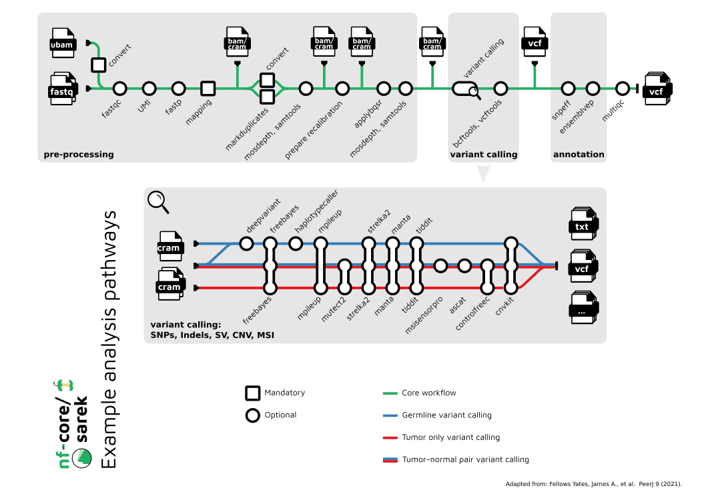

# Sarek

!!! abstract "Objectives"

    - Understand the Sarek workflow structure and default usage
    - Understand the levels of customisation available for nf-core workflows
    - Use the nf-core documentation to select appropriate parameters for a run command 
    - Write and run a nf-core sarek command on the command line 
    - Explore workflow deployment and outputs 

## The Sarek workflow

**nf-core/sarek** is a workflow designed to detect variants on whole genome or targeted sequencing data. Initially designed for Human, and Mouse, it can work on any species with a reference genome. Sarek can also handle tumour / normal pairs and could include additional relapses.

The workflow makes use of Docker / Singularity containers, making installation trivial and results highly reproducible. The Nextflow DSL2 implementation of this workflow uses one container per process which makes it much easier to maintain and update software dependencies. 

Depending on the options and samples provided, the workflow can currently perform the following:

- Form consensus reads from UMI sequences (`fgbio`)
- Sequencing quality control and trimming (`FastQC`, `fastp`)
- Map Reads to Reference (`BWA-mem` or `BWA-mem2` or `dragmap`)
- Process BAM file (`GATK MarkDuplicates`, `GATK BaseRecalibrator`, `GATK ApplyBQSR`)
- Summarise alignment statistics (`samtools stats`, `mosdepth`)
- Variant calling (enabled by `--tools`, see [compatibility](https://github.com/nf-core/sarek/blob/master/docs/usage.md#which-variant-calling-tool-is-implemented-for-which-data-type)):
    - `HaplotypeCaller`, `freebayes`, `mpileup`, `Strelka2`, `DeepVariant`, `Mutect2`, `Manta`, `TIDDIT`, `ASCAT`, `Control-FREEC`, `CNVkit`, and / or `MSIsensor-pro`
- Variant filtering and annotation (`SnpEff`, `Ensembl VEP`)
- Summarise and represent QC (`MultiQC`)

nf-core workflows are frequently represented as subway maps. The nf-core/sarek subway map is shown below and is a good place to start when first understanding how the workflow works.

<br>
<p align="center"></p> 
<br>

## Download the Sarek workflow

There are multiple ways you can download and store a copy of a nf-core workflow.

Firstly, you could use the `nextflow pull` command. By default, if you you the `nextflow run` command to execute a workflow from github it will also pull the workflow. In both of these cases the workflow will be stored in a hidden directory in your home directory.

Secondly, you could clone a copy of the workflow using the standard `git clone` command, e.g., `git clone https://github.com/nf-core/sarek.git`. This will download the workflow to your current working directory.

Finally you could use the `nf-core download` utility to download a copy of the workflow. This will give the the option to download the workflow code, the required singulariy images, and the institutional configs from the nf-core github repository. This method can be especially helpful if you are working offline and want to move all of the workflow code and tooling to a different machine.

!!! warning

    Each of these methods will download a copy of the workflow in a slightly different way may impact how you execute the workflow.

All nf-core workflows are provided with comprehensive documentation that explain what the default workflow structure entails and options for customising this based on your needs. It is important to remember that nf-core workflows typically do not include all possible tool parameters. Instead, they provide a sensible default set of parameters that are suitable for most use cases.

Each nf-core pipeline has a comprehensive set of documentation that can be used to understand what the workflow is doing and inform your choices about aspects of workflow-specific customisations.

## Getting started

The number and type of parameters an nf-core workflow accepts will differ between pipelines. The recommended (typical) run command and all the parameters available for the nf-core/sarek workflow can be viewed using the `--help` flag:

```bash
nextflow run nf-core/sarek --help 
```

At the top of the help output, you will see the recommended run command:

```bash
nextflow run nf-core/sarek --input samplesheet.csv --genome GATK.GRCh38 -profile docker
```

It outlines the requirement for three things: 

* An **input** samplesheet (`--input`)
* A reference **genome** (`--genome`) 
* A software management **profile** (`--profile`)

!!! tip "Hyphens matter"
    
    Nextflow-specific parameters use one (`-`) hyphen, whereas workflow-specific parameters use two (`--`).

## More information about Sarek

There is extensive information about nf-core pipelines on the [nf-core website](https://nf-co.re/). The dedicated Sarek pipeline page is the best resource for information about the pipeline and how to execute it.

## Testing a pipeline

Before running a workflow on your own data, it is a good idea to test the workflow on a small dataset. This will allow you to check that the workflow is working as expected and that you have the necessary software and data to run the workflow.

The `test` profile will run the workflow on a small test dataset that is included with the workflow code. 

```bash
nextflow run nf-core/sarek -profile test,singularity --outdir test_sarek
```

!!! question "Exercise"

    Check that Sarek is working as expected by running the workflow with the `test` profile. 
    
    ??? success "Solution"

        Run the test profile:

        ```bash
        nextflow run nf-core/sarek -profile test,singularity --outdir test_sarek
        ```

!!! abstract "Key points"

  - nf-core workflows are provided with sensible default settings and required inputs.
  - The `--help` flag can be used to view the recommended run command and all available parameters.
  - The `test` profile can be used to test that the workflow is working as expected.
