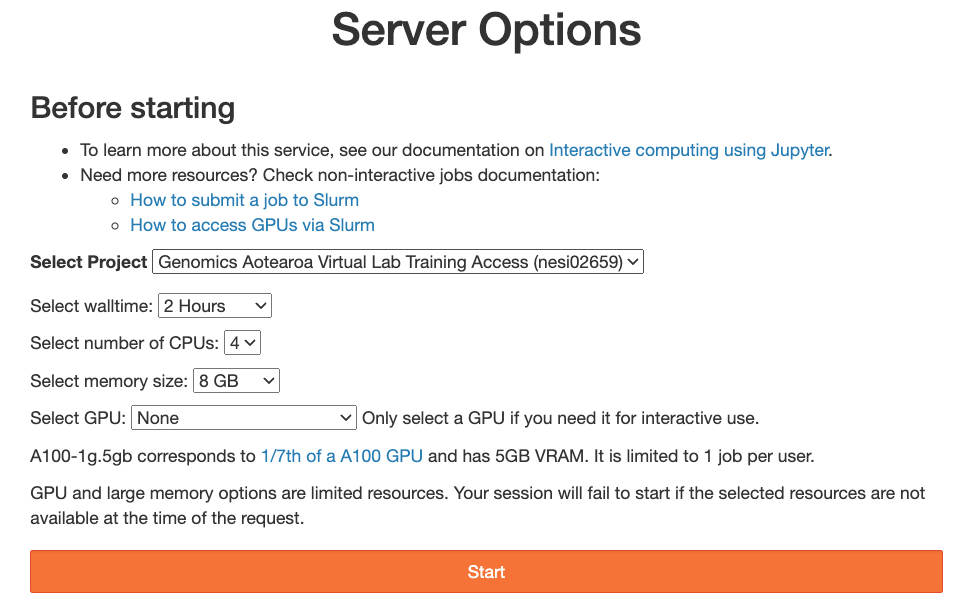
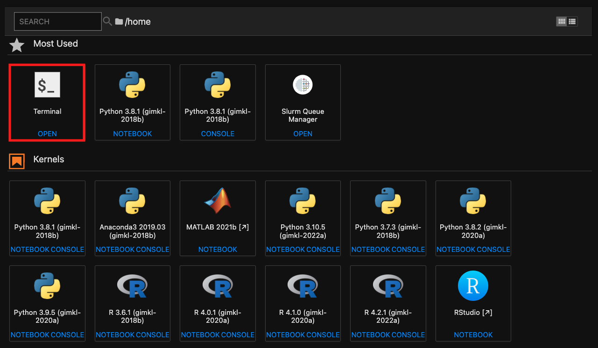

# Log into Nesi

During this workshop we will be running the material on the NeSI platform, using the Jupyter interface, however it is also possible to run this material locally on your own machine.

One of the differences between running on NeSI or your own machine is that on NeSI we pre-install popular software and make it available to our users, whereas on your own machine you need to install the software yourself (e.g., using a package manager such as conda).

??? jupyter "Connect to Jupyter on NeSI"

    1. Connect to [https://jupyter.nesi.org.nz](https://jupyter.nesi.org.nz)
    2. <p>Enter NeSI username, HPC password, and 6 digit second factor token (as set on <a href="https://my.nesi.org.nz/account/hpc-account">MyNeSI</a>)<br></p>
    3. <p>Choose server options as below
    <br>make sure to choose the correct project code `nesi02659`, number of CPUs **4**, memory **8GB** prior to pressing {width="60"} button. <br>{width="700"}
    4. <p>Start a terminal session from the JupyterLab launcher<br>{width="500"}

## Loading required software

This workshop will use a combination of "environment modules" and manually installed software.

We will need to prepare our environment by running the following command to source init script which clear the environment, load required software and activate the pre-configured conda environment

```bash
source /nesi/project/nesi02659/nextflow-workshop/init-nf-day1
```

??? screwdriver-wrench "Supplementary - How did we prepare the conda environment"


    ```bash
    module purge
    module load Miniconda3
    source $(conda info --base)/etc/profile.d/conda.sh

    conda config --add channels defaults
    conda config --add channels bioconda
    conda config --add channels conda-forge

    export CONDA_ENVS_PATH=/nesi/project/nesi02659/.conda/envs

    #make sure the conda pkgs gets-redirected to nobackkup/scratch space
    #for more information, refer to https://support.nesi.org.nz/hc/en-gb/articles/360001580415-Miniconda3#prevent-conda-from-using-home-storage
    mkdir /nesi/nobackup/nesi02659/conda-pkgs/$USER && conda config --add pkgs_dirs /nesi/nobackup/nesi02659/conda-pkgs/$USER
     
    conda create --name nf-core python=3.11 nf-core nextflow --solver=libmamba -y
    ```

More details about environment modules can be found on the [NeSI support page](https://support.nesi.org.nz/hc/en-gb/articles/360000360576-Finding-Software).
